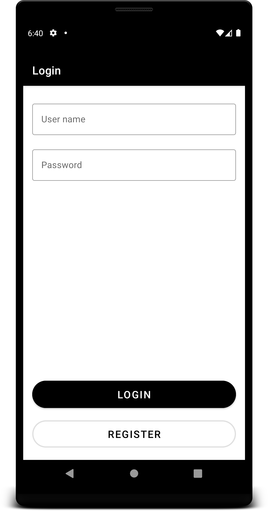
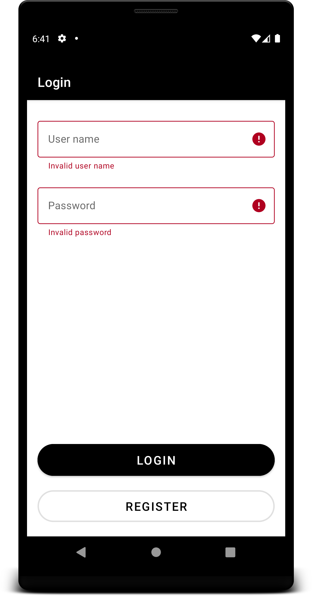
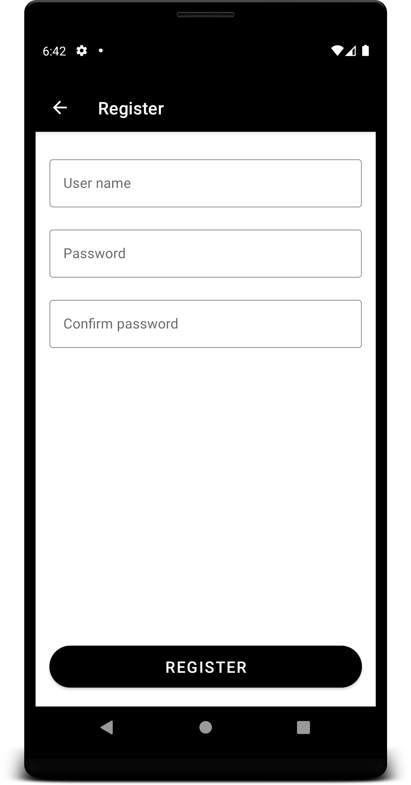
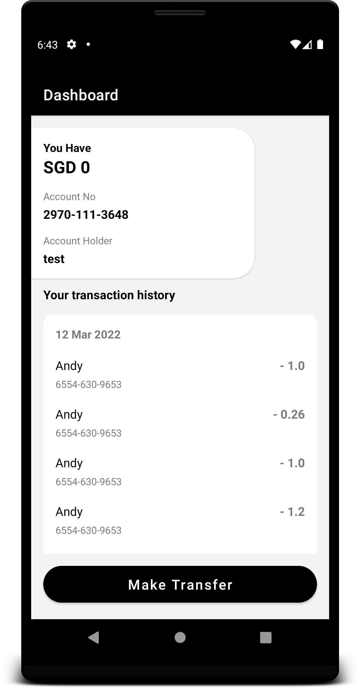
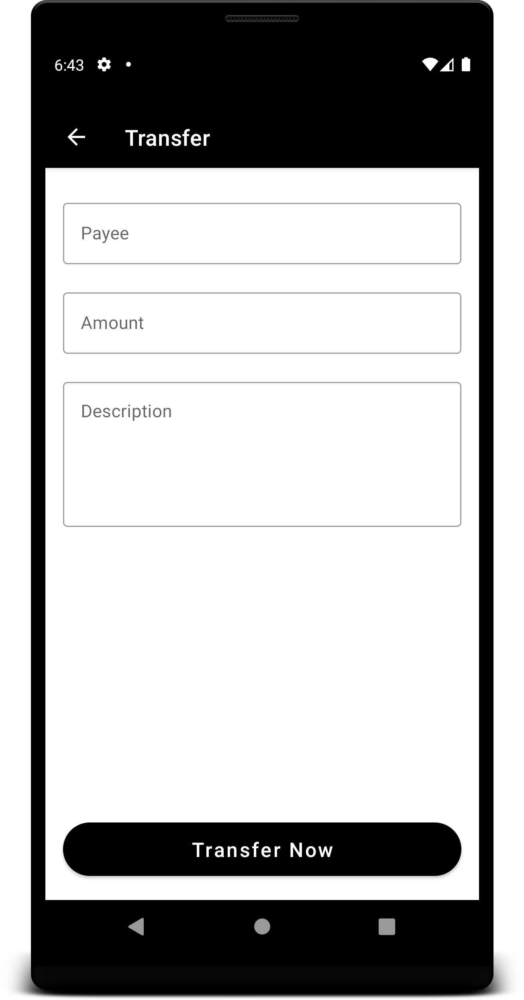

# Dashboard
A Dashboard project.\
Used MVVM Architecture.

**Screen completed:**\
1.Login\
2.Register\
3.Dashboard

**Screen pending:**\
1.Trasnfer

**Library used:**\
1.Retrofit -API call\
2.Moshi - To convert json <-> Kotlin\
3.Live data\
4.ViewModel\
5.Avi - Progressbar

[DOWNLOAD_APP_APK](https://drive.google.com/file/d/1i_U1Cvy8VUoEu2knmdXd7tA3C81k9j3G/view?usp=sharing)

**Screenshot**:

**Login**:

  
  

**Register:**

  

**Dashboard:**

  

**Transfer:**

  

